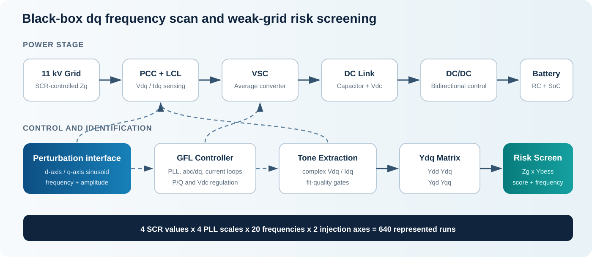
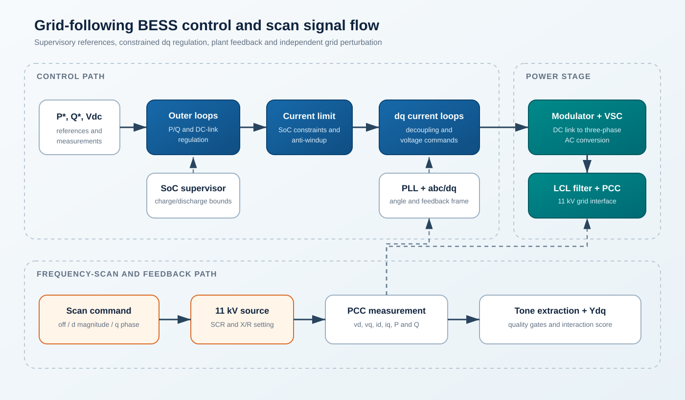
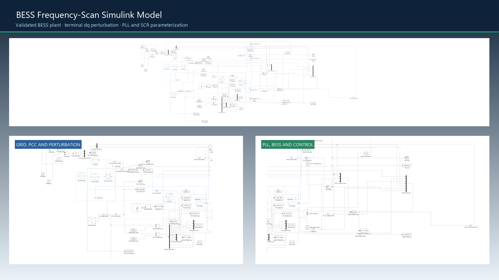
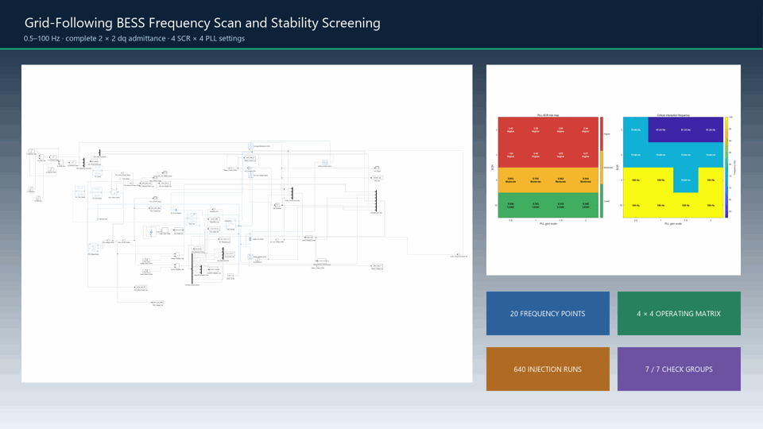
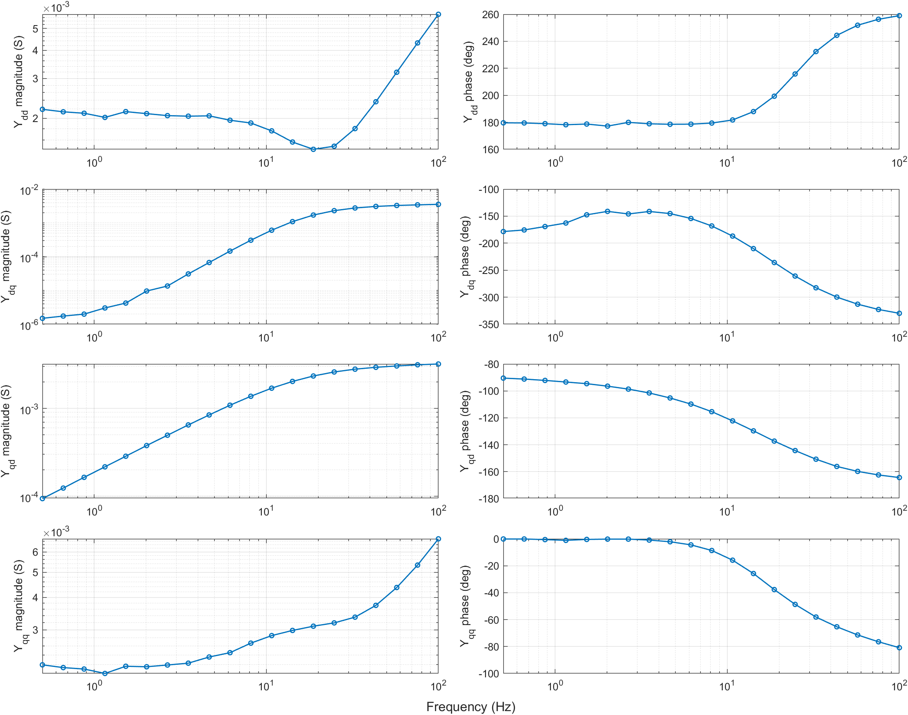
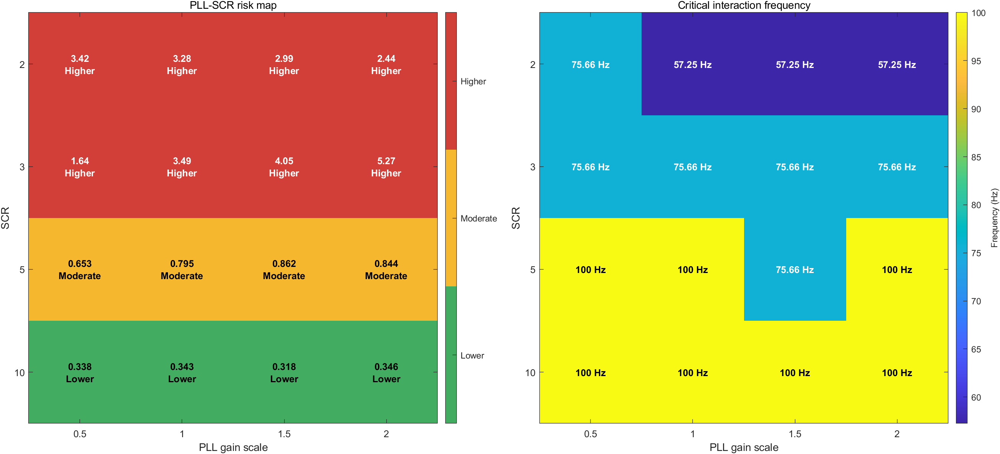
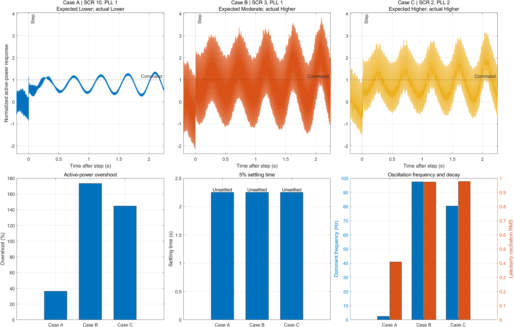

# Automated Frequency-Scan and Weak-Grid Stability Screening of a Grid-Following BESS

**English** | [简体中文](README.zh-CN.md)

[](https://www.mathworks.com/products/matlab.html)
[](https://www.mathworks.com/products/simulink.html)
[](https://henry-don.github.io/bess-frequency-scan-stability-screening/)
[](https://github.com/Henry-Don/bess-frequency-scan-stability-screening/actions/workflows/ci.yml)

This project extends a validated 11 kV, 50 Hz grid-connected battery energy storage system (BESS) model with a repeatable small-signal perturbation interface. It automatically identifies the complete black-box dq admittance, screens converter-grid interaction across short-circuit-ratio (SCR) and PLL settings, and cross-checks the frequency-domain ranking in time-domain simulation.

Quick evidence: [live project page](https://henry-don.github.io/bess-frequency-scan-stability-screening/) · [technical guide](docs/project_technical_guide.md) · [verification summary](docs/verification_summary.md) · [model description](docs/model_description.md)

## Version and Scope

The prepared release is **v0.6.1**. Its validated study covers 20 logarithmically spaced frequencies from 0.5 Hz to 100 Hz, four SCR values, four PLL gain scales and separate d-axis/q-axis injections. The complete 4 x 4 operating matrix represents 640 injection simulations. All numerical thresholds are fixed before the matrix comparison.

| Phase | Main entry point | Implemented content |
| --- | --- | --- |
| 1 | `models/bess_frequency_scan.slx` | Isolated model, shared baseline and controllable d-axis/q-axis perturbation interface |
| 2 | `scripts/run_frequency_scan.m` | Resumable 20-point scan and complete `Ydd`, `Ydq`, `Yqd`, `Yqq` identification |
| 3 | `scripts/run_scr_interaction_scan.m` | SCR 10/5/3/2 grid-impedance calculation, interaction score and critical-frequency extraction |
| 4 | `scripts/run_pll_risk_map.m` | Four PLL gain scales and a 4 x 4 relative-risk map |
| 5 | `scripts/run_time_domain_validation.m` | Three representative time-domain cases with overshoot, dominant frequency, decay ratio and settling status |
| Final validation | `tests/run_all_checks.m` | Fit-quality gates, independent 10 Hz repeatability, baseline equivalence and complete study checks |

## Architecture

### Physical System



The 11 kV BESS plant contains the RC battery, bidirectional DC/DC conversion, physical DC link, average-value VSC, LCL filter, grid-following control and PCC measurements inherited from the validated source model.

### Frequency-Scan and Control System



The scan uses a shared perturbation-disabled baseline followed by independent d-axis magnitude and q-axis phase injections. Least-squares tone extraction forms the complete dq voltage and current matrices. The interaction score is the maximum singular value of `Zgrid(jw) * Ybess(jw)`. Equations, thresholds and sign conventions are provided in the [technical guide](docs/project_technical_guide.md).

## Model Views

### Frequency-Scan Simulink Model



The image is exported from the saved `models/bess_frequency_scan.slx` file. The publication workflow does not save or rearrange model blocks.

## Requirements

| Component | Requirement | Verified environment |
| --- | --- | --- |
| MATLAB | MATLAB R2024b or later recommended | MATLAB 24.2 (R2024b) |
| Required modelling products | Simulink, Simscape and Simscape Electrical | R2024b products |
| Python | Python 3.10 or later; standard library only for repository checks | Python 3.11 compatible |
| Operating system | MATLAB-compatible desktop OS; scripts use repository-relative paths | Windows 11 |
| Optional media generation | Image Processing Toolbox and Computer Vision Toolbox | R2024b products |

The model is an average-value system study. No switching-device model or vendor-specific control library is required. The optional products are used only by `generate_portfolio_media.m`, not by model execution.

## Live Reports and Demo



The same demonstration is available as a higher-quality [MP4 video](docs/media/bess_demo.mp4). The [project page](https://henry-don.github.io/bess-frequency-scan-stability-screening/) presents the architecture, model view, main plots and engineering boundary. Detailed notes are available in both languages:

- [English technical guide](docs/project_technical_guide.pdf)
- [Chinese technical guide](docs/project_technical_guide.zh-CN.pdf)
- [English verification summary](docs/verification_summary.md)
- [Chinese verification summary](docs/verification_summary.zh-CN.md)

## Quick Start

1. Open MATLAB in the repository root, or add the repository root to the MATLAB path.
2. Run the complete local validation:

```matlab
run('tests/run_all_checks.m');
```

3. Open `models/bess_frequency_scan.slx` to review the model. Run a single 10 Hz identification with:

```matlab
run('scripts/run_single_frequency_demo.m');
```

Generated MAT files and plots are written under `results/`. The scan saves each completed frequency and resumes only when the saved configuration signature matches the requested case.

## Regression Validation

Run the stage-level checks:

```matlab
run('tests/run_phase1_interface_check.m');
run('tests/run_phase1_repeatability_check.m');
run('tests/run_phase1_baseline_equivalence_check.m');
run('tests/run_phase2_frequency_scan_check.m');
run('tests/run_phase3_scr_interaction_check.m');
run('tests/run_phase4_pll_risk_map_check.m');
run('tests/run_phase5_time_domain_check.m');
```

Run the main studies individually:

```matlab
run_frequency_scan([]);
run_scr_interaction_scan;
run_pll_risk_map;
run_time_domain_validation;
```

The repository check used by continuous validation is `python/verify_repository.py`. It verifies the publication structure and excludes generated Simulink cache files from the release surface.

## Representative Results

### Complete dq Admittance



All four matrix entries are retained, including cross coupling. Across the full scan, the maximum main-voltage residual is 0.63%, the maximum weighted current residual is 14.23%, and the maximum cross-voltage leakage is 3.29%; all satisfy the configured quality limits.

### SCR and PLL Risk Map



SCR 10 remains Lower, SCR 5 remains Moderate, and SCR 3/SCR 2 are Higher for all four PLL scales. The critical interaction frequencies lie between 57.25 Hz and 100 Hz.

### Time-Domain Cross-Check



Case A calculates as Lower, while Cases B and C calculate as Higher. Case B was originally planned as Moderate and is intentionally retained with its calculated Higher label. Overshoot ordering agrees with the frequency-domain ranking for 3/3 comparable pairs; decay-ratio ordering agrees for 2/3. None of the three cases enters the 5% settling band inside the 2.25 s observation window.

## Verified Results and Boundaries

The complete local entry point reports 7/7 check groups passed. The independent 10 Hz repeatability check measures 0% magnitude drift and 0 degree phase drift. Nine baseline signals match the source model within the configured numerical tolerance. The validated revision also reports zero static-analysis findings across 42 MATLAB files.

The risk levels are comparative indicators for the defined model and operating points. They do not provide a formal generalized-Nyquist stability certificate, switching-harmonic assessment, vendor-model validation, hardware result, protection-coordination study or grid-code approval.

See the [technical guide](docs/project_technical_guide.md) for the method and results, the [verification summary](docs/verification_summary.md) for acceptance evidence, and the [model description](docs/model_description.md) for file-level entry points.

## Rights and Use

Copyright © 2026 Henry Tang. All rights reserved. No permission is granted to reuse, modify, or redistribute this repository without prior written authorization. No `LICENSE` file is provided.
